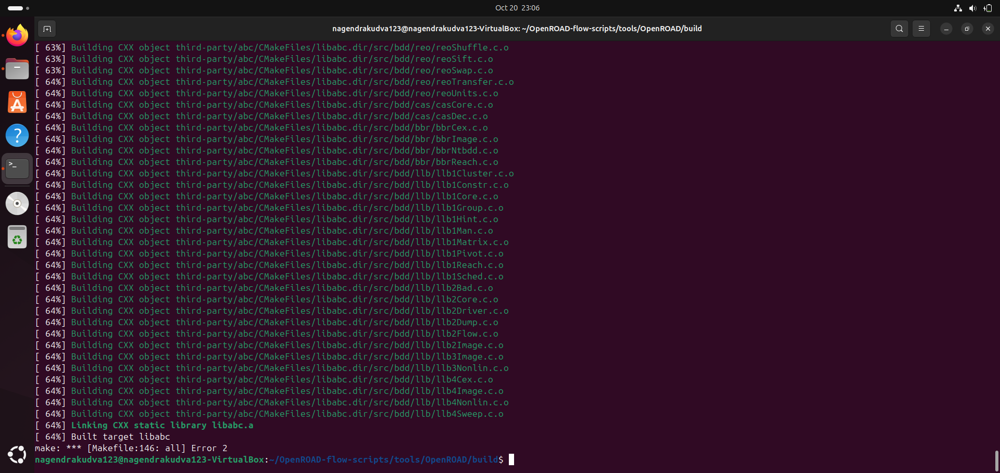

## ⚠️ Build Error During OpenROAD Installation

During the build process, the command:

```bash
./build_openroad.sh --local
```
stopped at around 63% and displayed multiple Input/Output errors while compiling the third-party libraries (such as bdd and abc).

🧾 Sample Error Snippet:

```bash
Building CXX object third-party/abc/CMakeFiles/libabc.dir/src/bdd/bbr/bbrCex.c.o
/home/username/OpenROAD-flow-scripts/tools/OpenROAD/third-party/abc/src/bdd/bbr/bbrCex.c: Input/output error
make[2]: *** [CMakeFiles/libabc.dir/src/bdd/bbr/bbrCex.c.o] Error 1
make[1]: *** [Makefile:*** Error 2]
make: *** [all] Error 2

```


---

🧠 Root Cause

The issue occurs because the ./setup.sh script sometimes fails to install all required dependencies in certain Linux environments or virtual machines.
As a result, the build process breaks partway through, especially when compiling libraries that depend on system-level packages.


---

✅ Solution Implemented

Instead of using the main setup script, dependencies were installed manually and explicitly using the built-in dependency installer script:

```bash
sudo ./etc/DependencyInstaller.sh -all
````
Once all dependencies were successfully installed, the build was re-run:

```bash
./build_openroad.sh --local
```
💡 This time, the build completed successfully without any interruptions or errors.


---

🔍 Key Takeaways

Always ensure all dependencies are installed before building OpenROAD.

Running the dependency installer manually (DependencyInstaller.sh -all) ensures no missing libraries.

After successful installation, remember to source the environment before running OpenROAD:

```bash
source ./env.sh
````
---
