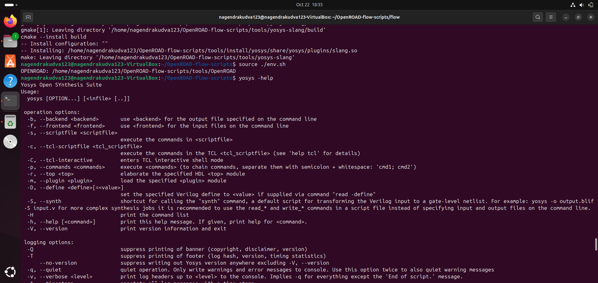
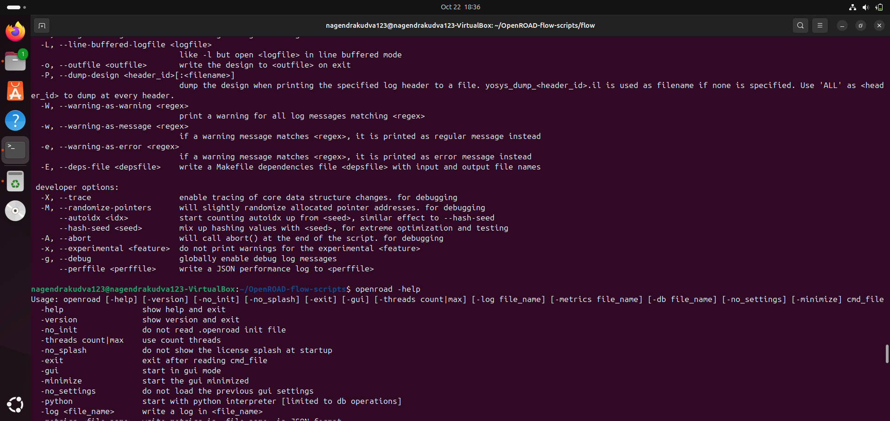
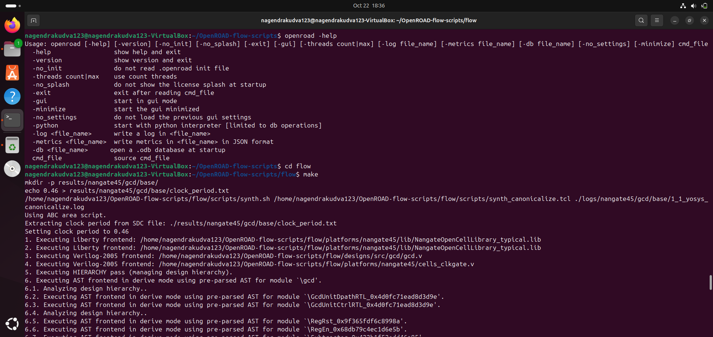
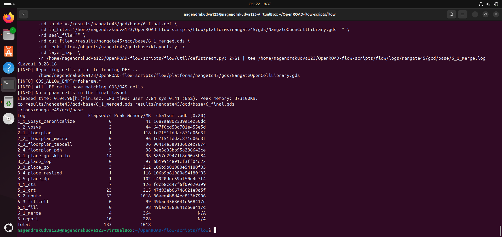
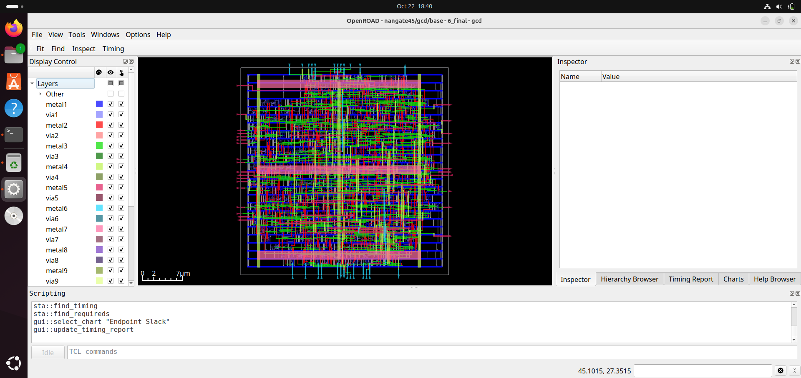

## OpenROAD installation guide

### 📚 Contents

  - [Steps to Install OpenROAD and Run GUI](#steps-to-install-openroad-and-run-gui)
    - [1. Clone the OpenROAD Repository](#1-clone-the-openroad-repository)
    - [2. Run the Setup Script](#2-run-the-setup-script)
    - [3. Build OpenROAD](#3-build-openroad)
    - [4. Verify Installation](#4-verify-installation)
    - [5. Run the OpenROAD Flow](#5-run-the-openroad-flow)
    - [6. Launch the GUI](#6-launch-the-graphical-user-interface-gui-to-visualize-the-final-layout)


**OpenROAD** is an open-source, fully automated RTL-to-GDSII flow for digital integrated circuit (IC) design. It supports synthesis, floorplanning, placement, clock tree synthesis, routing, and final layout generation. OpenROAD enables rapid design iterations, making it ideal for academic research and industry prototyping.

### `Steps to Install OpenROAD and Run GUI`

### 1. Clone the OpenROAD Repository

```bash
git clone --recursive https://github.com/The-OpenROAD-Project/OpenROAD-flow-scripts
cd OpenROAD-flow-scripts
```

### 2. Run the Setup Script

```bash
sudo ./setup.sh
```

### 3. Build OpenROAD

```bash
./build_openroad.sh --local
```


### `Alternative way of Installation`

### 1. Clone the OpenROAD Repository

```bash
git clone --recursive https://github.com/The-OpenROAD-Project/OpenROAD-flow-scripts
cd OpenROAD-flow-scripts
```

### 2. Set the dependencies separately

```bash
sudo ./etc/DependencyInstaller.sh -all
```

### 3. Build OpenROAD

```bash
./build_openroad.sh --local
```

### 4. Verify Installation

```bash
source ./env.sh
yosys -help  
openroad -help
```









### 5. Run the OpenROAD Flow

```bash
cd flow
make
```



### 6. Launch the graphical user interface (GUI) to visualize the final layout

```bash
 make gui_final
```



✅ Installation Complete! You can now explore the full RTL-to-GDSII flow using OpenROAD.
