## OpenROAD Flow

### 🧩 Major Stages in the OpenROAD Flow

| Stage | Description | Output |
|--------|--------------|---------|
| *1. Synthesis* | Converts RTL (Verilog) into a gate-level netlist using logic synthesis tools (e.g., Yosys). | netlist.v |
| *2. Floorplanning* | Defines chip *die area, **core area, and **I/O pin* locations; sets up *power grid* and *placement rows*. | floorplan.def |
| *3. Placement* | Arranges standard cells within the core area to minimize wirelength and congestion. | placement.def |
| *4. Clock Tree Synthesis (CTS)* | Inserts buffers and inverters to distribute the clock signal uniformly with minimal skew. | cts.def |
| *5. Routing* | Connects all signal and clock nets using metal layers while avoiding design rule violations (DRC). | route.def |
| *6. Optimization* | Performs timing, power, and area optimizations post-route to ensure closure. | Updated .def & reports |
| *7. GDSII Generation* | Exports final *GDSII* file for fabrication after all checks are clean. | final.gds |


### Glimpses of the flow.tcl file

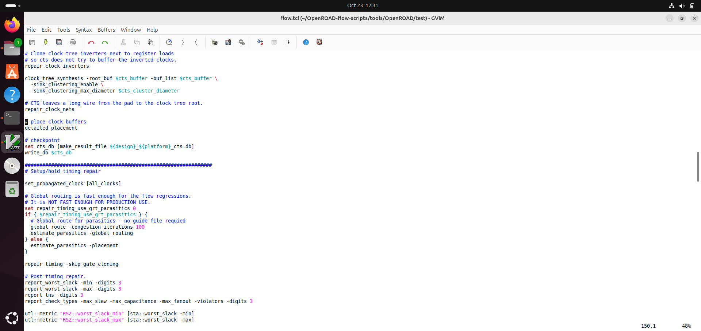


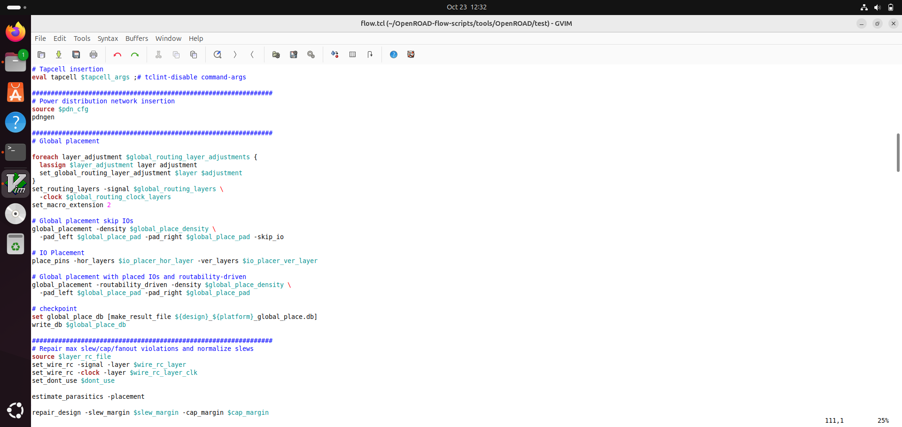


---

### 🧱 Floorplan and Placement in OpenROAD

After successfully setting up OpenROAD, the next steps involve performing *Floorplanning* and *Placement*.  
These are the initial stages of physical design where the logical netlist is translated into a preliminary physical layout.


### ⚙️ 1. Floorplanning Stage

*Purpose:*  
Floorplanning defines the physical boundaries of the chip — determining the *die area, **core area, **I/O pin locations, and **power grid structure*.

*Key Operations Performed:*
- Define chip size and aspect ratio.  
- Set *core utilization* (typically 60–70%).  
- Place I/O pins around the periphery.  
- Generate *power rings* and routing tracks.  
- Create a base for placement and routing stages.

*Commands Used:*
```bash
cd OpenROAD-flow-scripts/flow
make DESIGN_CONFIG=./designs/nangate45/gcd/config.mk floorplan
```
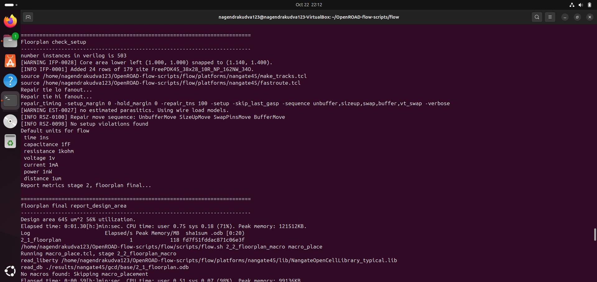


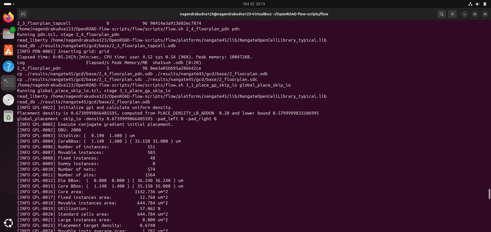

#### Die area

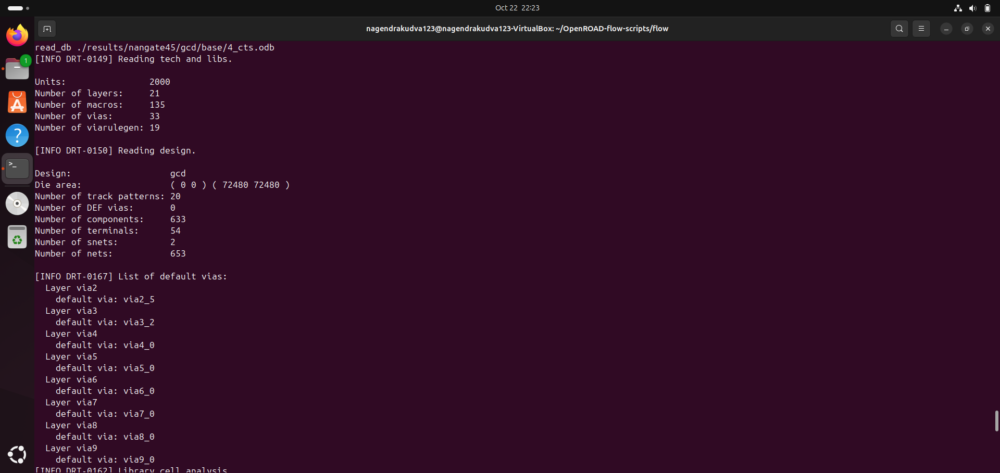


#### Cell Report

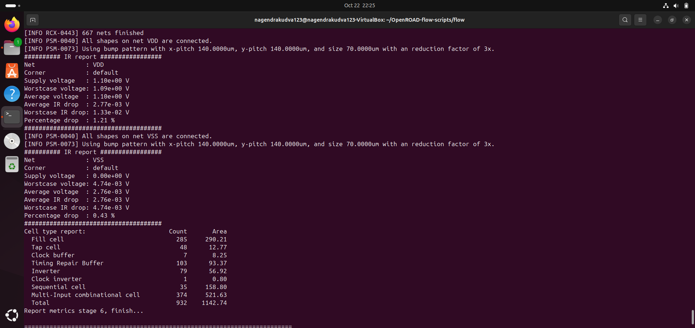

---


### 🧩 Placement Stage

After completing floorplanning, the next major step in the physical design flow is *Placement*.  
Placement determines the exact locations of all *standard cells* within the defined core area, aiming to minimize delay, wirelength, and routing congestion.

---

### ⚙️ Purpose of Placement
- Arranges all standard cells legally inside the *core boundary*.  
- Optimizes total *wirelength* and ensures cells are aligned to *placement rows*.  
- Prepares the design for *Clock Tree Synthesis (CTS)* and *Routing*.  

---

### 🧠 What Happens Internally
1. *Global Placement*  
   - Performs a coarse placement of standard cells to estimate wirelength and congestion.  
   - The algorithm spreads cells evenly to avoid clustering.

2. *Detailed Placement*  
   - Fine-tunes positions to align cells exactly on legal grid sites.  
   - Ensures no overlaps, spacing violations, or out-of-bound placements.

3. *Placement Optimization*  
   - Adjusts for timing, density, and congestion hotspots.

---

### 🧰 Commands Used

```bash
cd OpenROAD-flow-scripts/flow
make DESIGN_CONFIG=./designs/nangate45/gcd/config.mk place
```

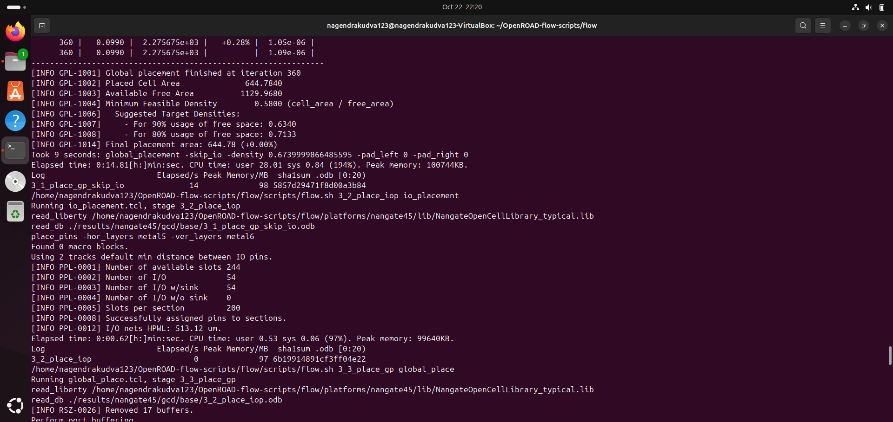

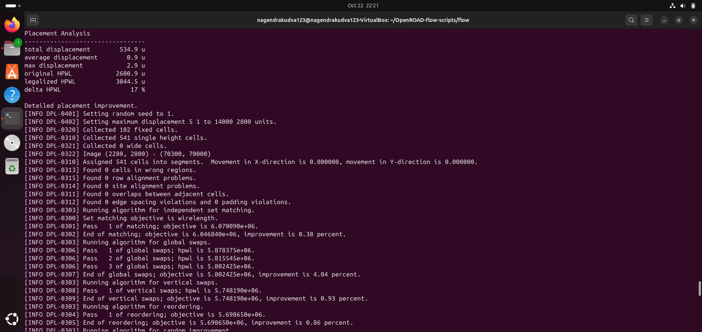


#### Timing report in the flow


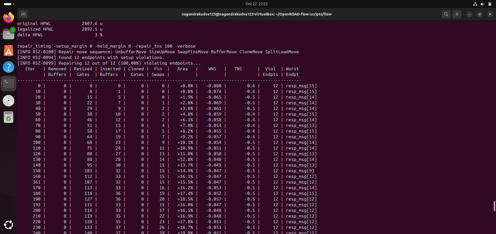


#### Standard Cells placed


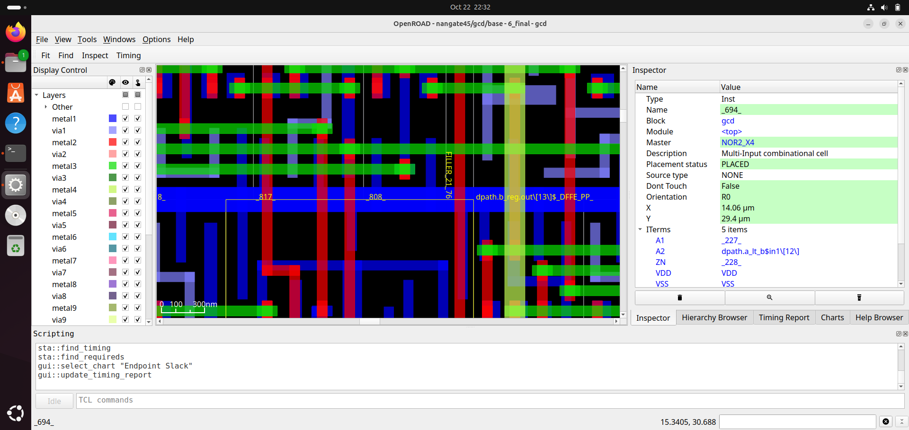


#### Inverter cell


### Examples to Test

#### gcd_nangate45.tcl file


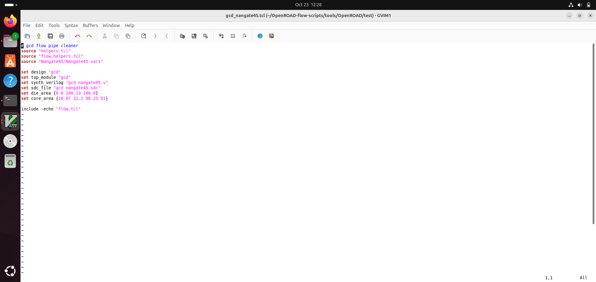


#### Die area and Rows

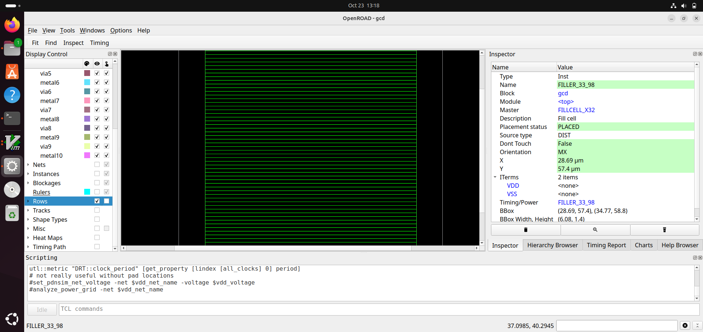


